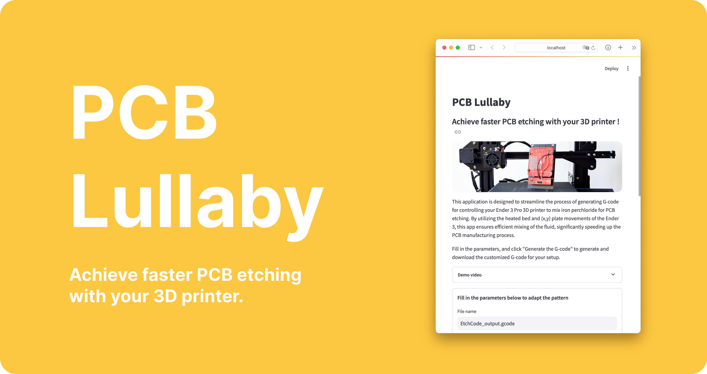

<div align="center">
  
</div>

<h3 align="center">
  <b><a href="https://pcb-lullaby.streamlit.app">Online App</a></b>
  •
  <b><a href="#python-api">Python API</a></b>
  •
  <b><a href="http://www.youtube.com/watch?v=_3DP3HD8CqY">Demo Video</a></b>
</h3>

<div align="center">
  <a href="https://opensource.org/licenses/MIT">
    
  </a>
  
</div>
</br>

<p align="center">The <b>PCB Lullaby</b> project is an innovative tool that streamlines the PCB etching process by utilizing a 3D printer's moving bed to mix the etching fluid. Designed for use with an Ender 3 Pro 3D printer and a few additional components, this tool enables makers and hobbyists to create high-quality PCBs more quickly and efficiently.</p>

## How it Works

The PCB Lullaby tool is specifically designed to agitate the etching fluid in an etching tank positioned on a 3D printer's bed. It utilizes G-code commands to control the bed's movements, oscillating it back and forth to mix the etching fluid effectively. This agitation accelerates the etching process and enhances the quality of the results. Additionally, PCB Lullaby is capable of heating the solution, further optimizing the chemical process.

## Features

The PCB Lullaby tool offers a range of user-friendly and customizable features, including:

- **Calibration**: Ensures proper alignment of the 3D printer through an integrated calibration process.
- **Preheating**: Facilitates preheating of the etching fluid to optimize the chemical process.
- **Customizable Parameters**: Allows users to adjust various settings, such as bed temperature, mix duration, and speed.
- **Online Streamlit Application**: Provides an accessible online interface for easy operation and control.

## Run app locally
If you want to run the PCB Lullaby streamlit app locally. Multiple solution are possible :

1. **Run the app directly in a virtual environnement**
    
    clone repository:
    ```
    git clone https://github.com/chloelavrat/PCB-Lullaby.git
    cd pcb-lullaby
    ```
    Create, activate and install your environnement:
    ```
    python -m venv .venv
    source .venv/bin/activate
    pip install -r requirements.txt
    ```
    Run the app using streamlit:
    ```
    streamlit run streamlit-app.py
    ```

2. **Run the app using docker**

    Build the `pcb-lullaby` docker container:
    ```
    docker build -t pcb-lullaby .
    ````
    Run the container at a specified port (here 8501) 
    ```
    docker run -p 8501:8501 pcb-lullaby
    ```
    Go to your web browser and access [localhost:8501](http://localhost:8501)

## Python API

To get started with the PCB Lullaby project, you will need an Ender 3 Pro 3D printer and an etching tank. To use the _pcb-lullaby_ code, follow these steps:

```
$ git clone https://github.com/azerty-labs/PCB-Lullaby.git
$ cd pcb-lullaby
```

Then you can directly run the python code as the script depends on no external library. To use this Python script with argparse, you need to open a terminal and type:

```
python ./src/perchloride_mixer_generator.py FILE [--bedtemp BEDTEMP] [--timemix TIMEMIX] [--numwait NUMWAIT] [--speed SPEED] [--zposition ZPOSITION] [--frontposition FRONTPOSITION] [--backposition BACKPOSITION]
```

Note that the default value are for an Ender-3 Pro 3D-printer:

```
$ python ./src/perchloride_mixer_generator -h
usage: perchloride_mixer_generator [-h] [--bedtemp BEDTEMP] [--timemix TIMEMIX] [--numwait NUMWAIT]
                                  [--speed SPEED] [--zposition ZPOSITION]
                                  [--frontposition FRONTPOSITION] [--backposition BACKPOSITION]
                                  FILE

perchloride mixer gcode

positional arguments:
  FILE                  name of the gcode file

options:
  -h, --help            show this help message and exit
  --bedtemp BEDTEMP     bed temperature (default: 30)
  --timemix TIMEMIX     duration of the mix, in minutes (default: 1)
  --numwait NUMWAIT     number of messages at start ("Place Circuit NOW!") (default: 2)
  --speed SPEED         speed of the bed (default: 2000)
  --zposition ZPOSITION
                        Z position to free space for the glass container (default: 200)
  --frontposition FRONTPOSITION
                        X position of bed in front mode (default: 125)
  --backposition BACKPOSITION
                        Y position of bed in back mode (default: 150)
```

Here's an example of how to use this script:

```
python ./src/perchloride_mixer_generator.py my_circuit.gcode --bedTemp 30 --timeMix 1 --numWait 2 --speed 1500 --zPosition 200 --frontPosition 120 --backPosition 150
```

This will create a new G-code file called `my_circuit.gcode` with the given parameters. Note that if you omit any of the optional arguments, the script will use the default values.

## Contributing

The PCB Lullaby project is an open-source project, and contributions are always welcome. If you would like to contribute to the project, you can do so by submitting a pull request or by creating an issue on the project's GitHub page.

## License

The PCB Lullaby project is licensed under the MIT License. See the [LICENSE](LICENSE) file for details.
